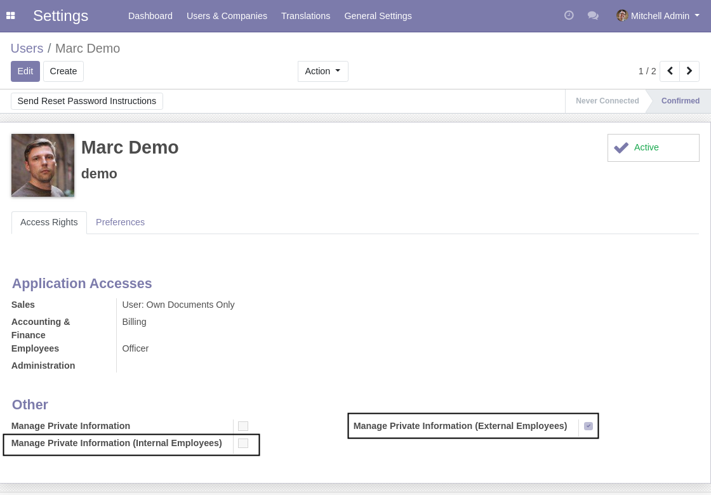
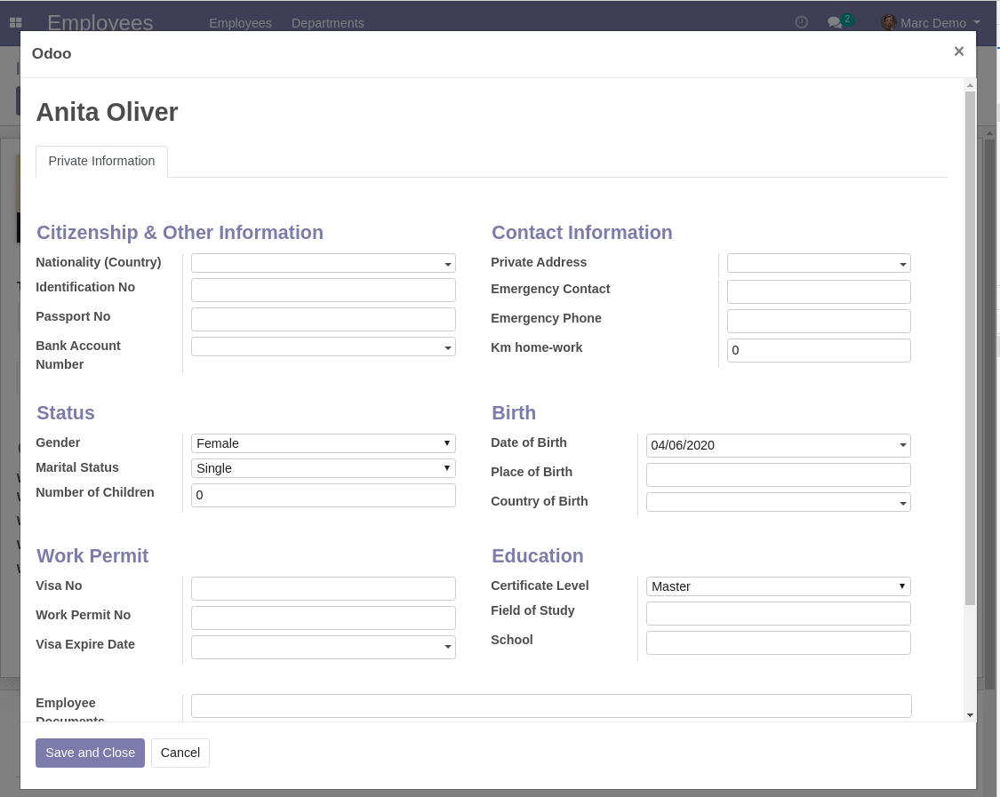

HR Employee Type Private Wizard
===============================

.. contents:: Table of Contents

Context
-------

hr_employee_type
~~~~~~~~~~~~~~~~
The module `hr_employee_type <https://github.com/Numigi/odoo-hr-addons/tree/12.0/hr_employee_type>`_
adds a field to distinguish ``Internal`` and ``External`` employees.

private_data_group
~~~~~~~~~~~~~~~~~~
The module `private_data_group <https://github.com/Numigi/odoo-base-addons/tree/12.0/private_data_group>`_
allows to customize ``Private Fields`` on employees.

It adds a group ``Manage Private Information`` allowed to read and edit the private fields.
The private fields are hidden to other users.

Summary
-------
This module adds 2 groups.

* Manage Private Information (Internal Employees)
* Manage Private Information (External Employees)

These 2 groups have access to the private fields for their respective employee type (Internal / External).

Usage
-----
As member of ``Manage Private Information (Internal Employees)``, I go to the form view of an internal employee.

1. I notice a new button ``Private Information``
2. The ``Private Information`` tab is hidden.

When I click on the ``Private Information`` button, a wizard is opened:

I can edit the form and save.

I go to the form view of an external employee.

I do not see the button ``Private Information`` because I am not member of the group ``Manage Private Information (External Employees)``.

Module Design
-------------
The reason that a wizard is used to edit the private data is because it offers more flexibility over the access control.

The wizard serves as a proxy between the user and the employee record.

Each access in read / write to the wizard is controlled with specific rules.
If these checks pass, the read / write operation is applied to the related employee.

Contributors
------------
* Numigi (tm) and all its contributors (https://bit.ly/numigiens)
