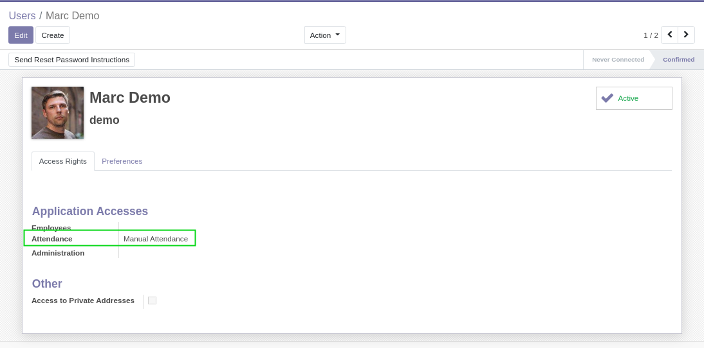
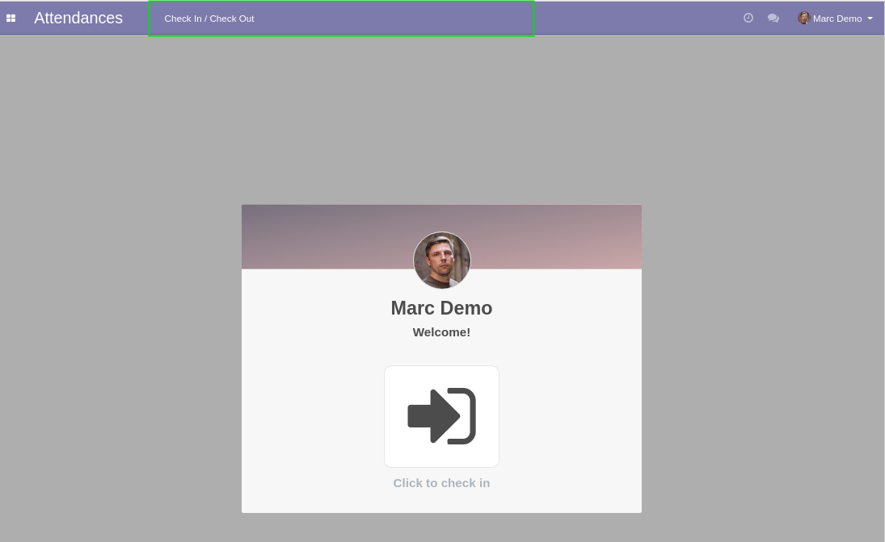
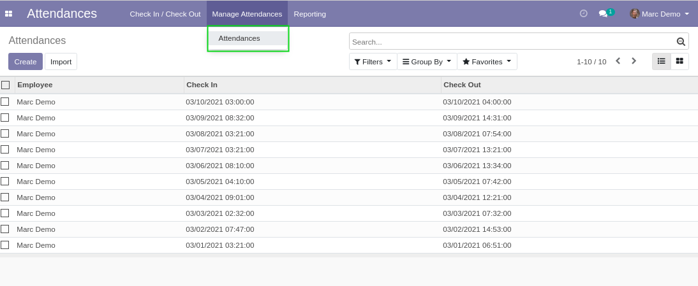
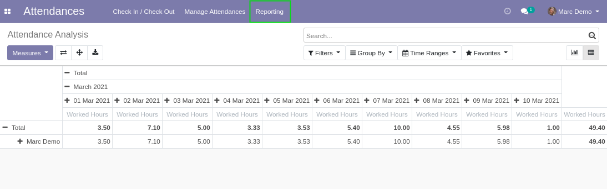

HR Attendance Menu Unrestricted
===============================

.. contents:: Table of contents

Context
-------
In vanilla Odoo, members of the group ``Manual Attendance`` do not have very restricted access
the menus of the attendance app.

They do not have access to the list and pivot view of attendances.

Usage
-----
With the module installed, as member of the group ``Manual Attendance``, I have access
to the list view of attendances.

Only my own attendances are visible in the list.

I have also access to the attendance analysis report.

Contributors
------------
* Numigi (tm) and all its contributors (https://bit.ly/numigiens)
