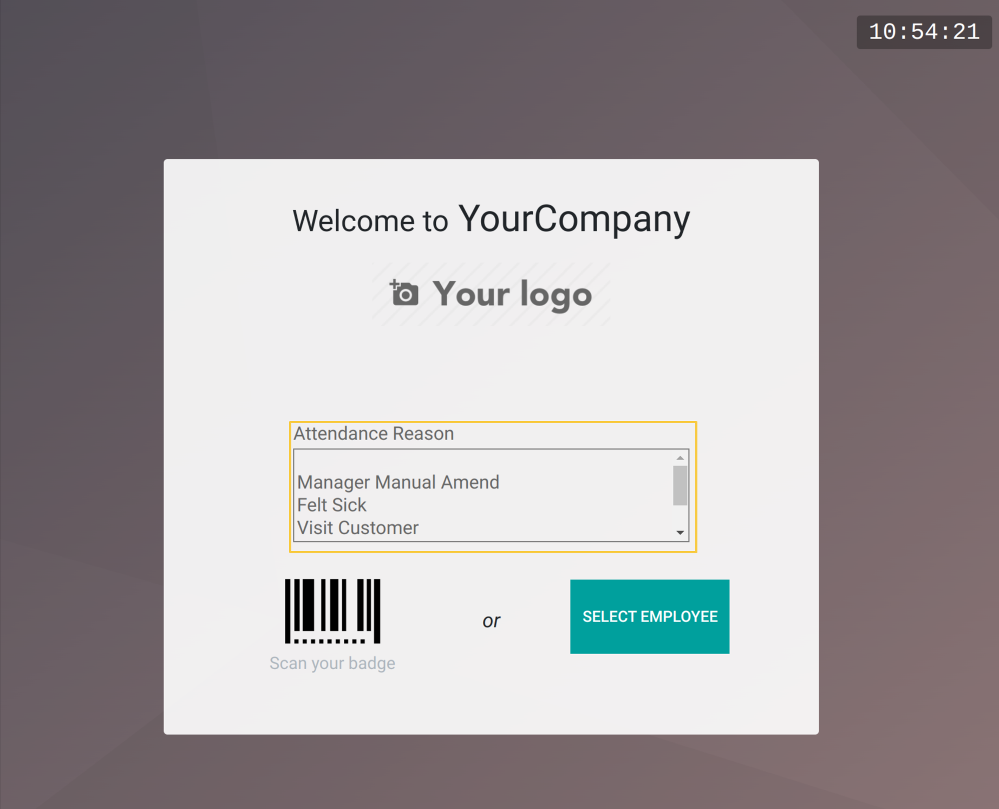
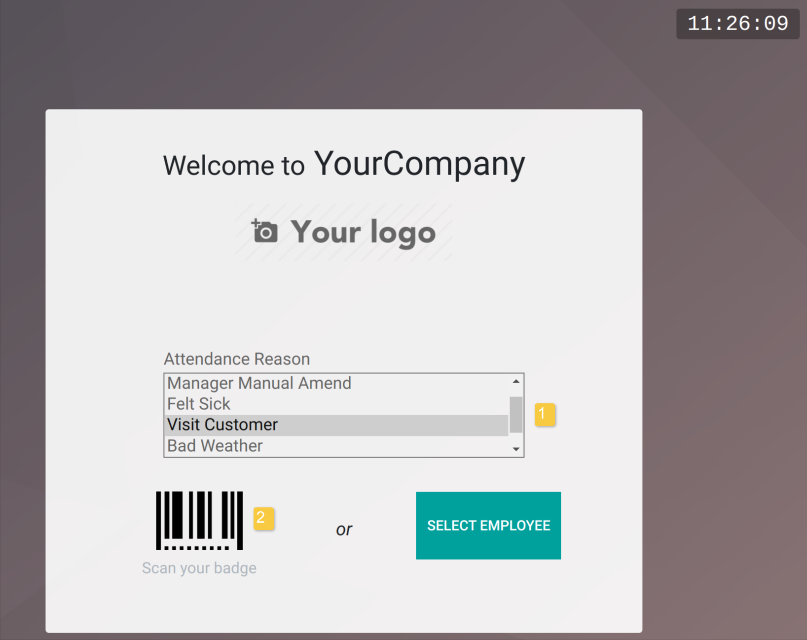
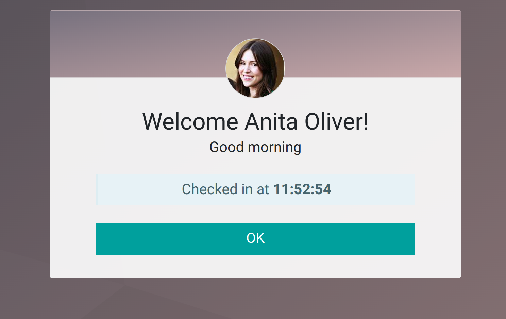
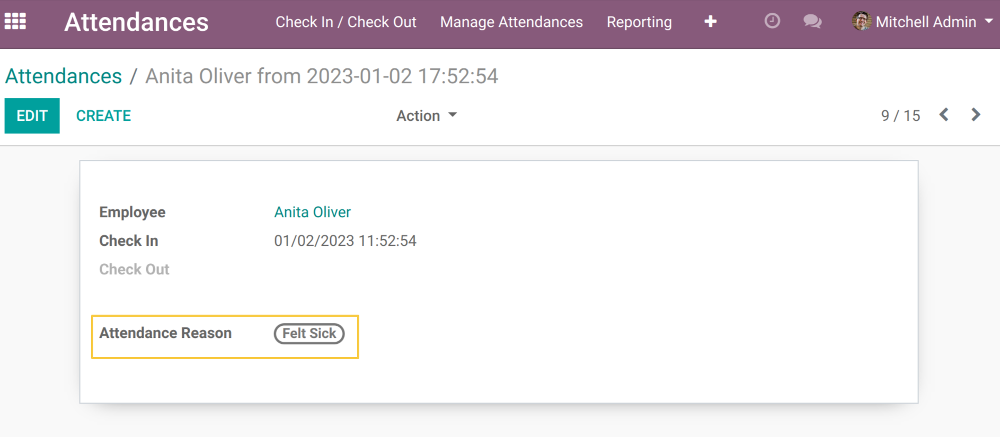
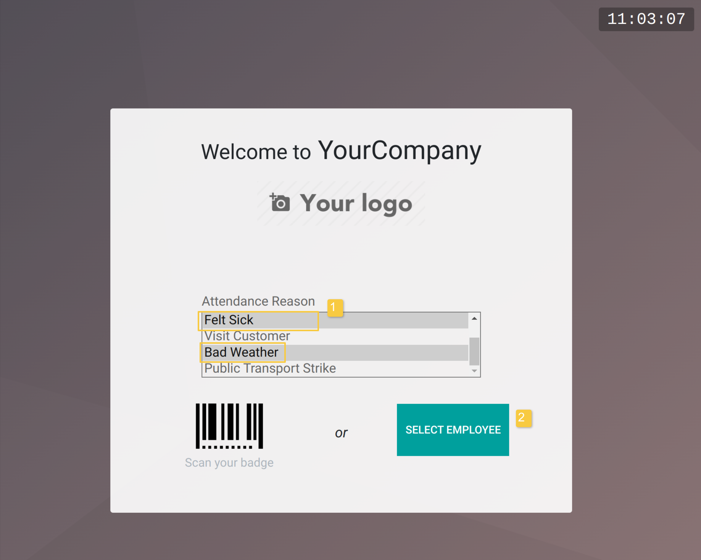
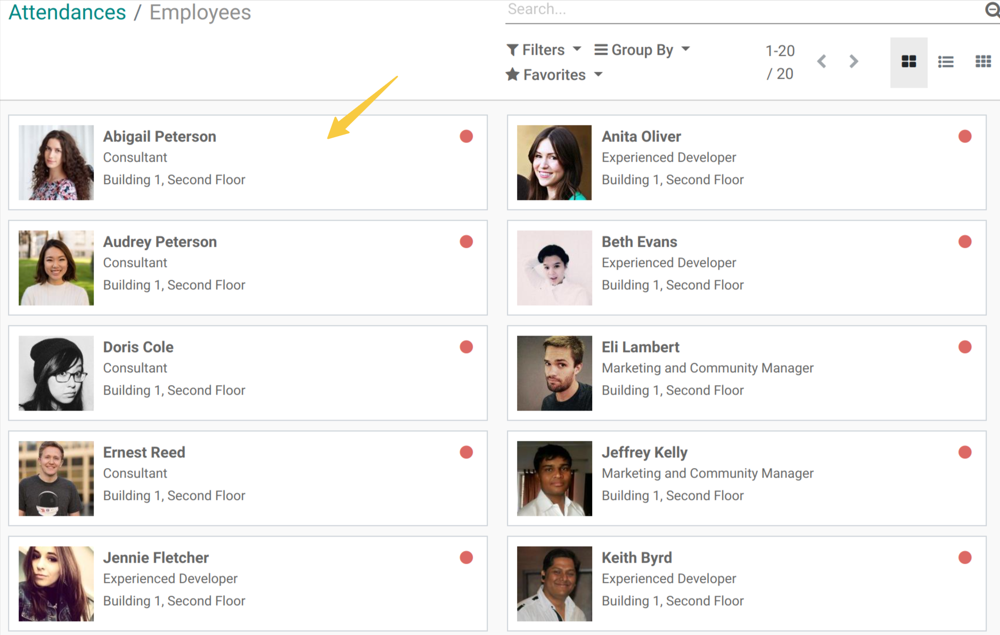
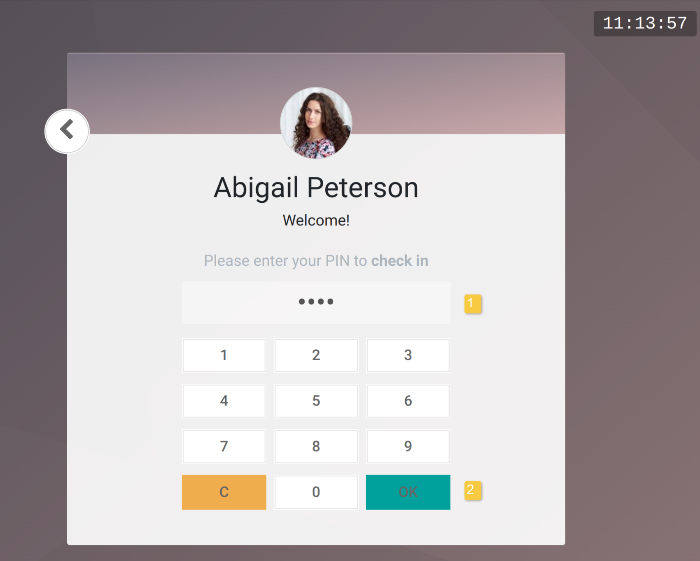
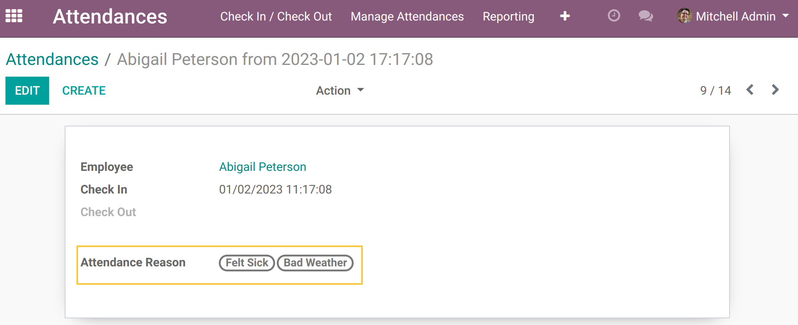

HR Attendance Reason Kiosk Mode
=================================

This module uses the community module `hr_attendance_reason <https://github.com/OCA/hr/tree/12.0/hr_attendance_reason>`__ witch allows the creation of a list of reasons that can be selected on entry or exit.

Then gives access to select reasons from kiosk mode.

Usage
-----

Use with badge and scanner
~~~~~~~~~~~~~~~~~~~~~~~~~~
As an employee, I go to the device that has kiosk mode enabled.

I see that a new field `Attendance Reason` is present.

This field allows me to select one or more reasons.

I select one or more reasons and scan my badge.

As a user belonging to the `Attendances > Officer` group, I go to `Attendances > Manage attendances > Attendances`

I open the form view of the attendance recorded by scan.

I see that the selected reasons are present in the `Attendance Reason field`.

Use with PIN
~~~~~~~~~~~~
As an employee, I go to the device that has kiosk mode enabled.

I select one or more reasons and I click on `Select an employee`.

As a user belonging to the `Attendances > Officer` group, I go to `Attendances > Manage attendances > Attendances`

I open the form view of the attendance recorded by PIN.

I see that the selected reasons are present in the `Attendance Reason field`.

Contributors
------------
* Numigi (tm) and all its contributors (https://bit.ly/numigiens)

More information
----------------
* Meet us at https://bit.ly/numigi-com
