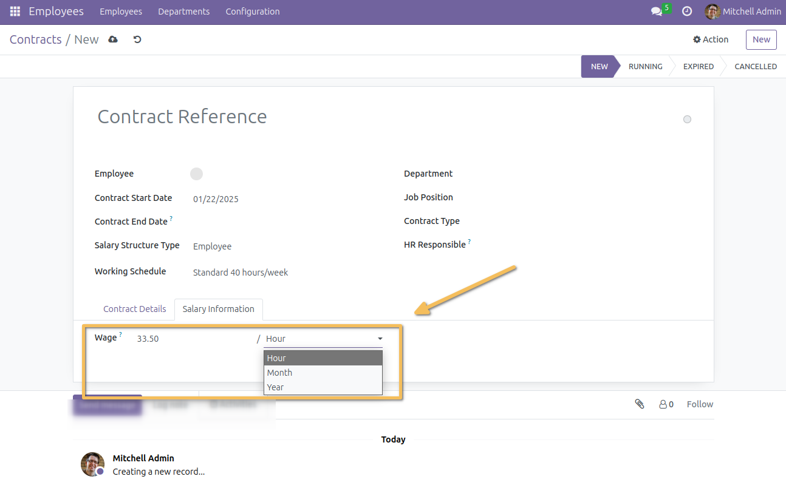

HR Contract Wage Type
=====================
This module adds the `Wage Type` field on contracts.

This field is used to distinguish between hourly, monthly and yearly wages.

Contributors
------------
* Numigi (tm) and all its contributors (https://bit.ly/numigiens)
