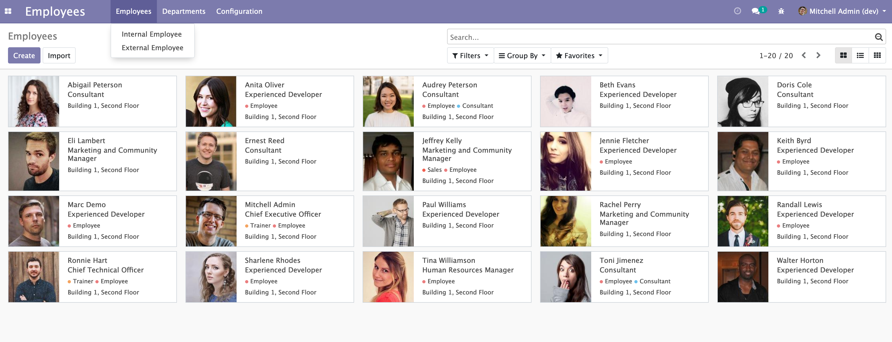
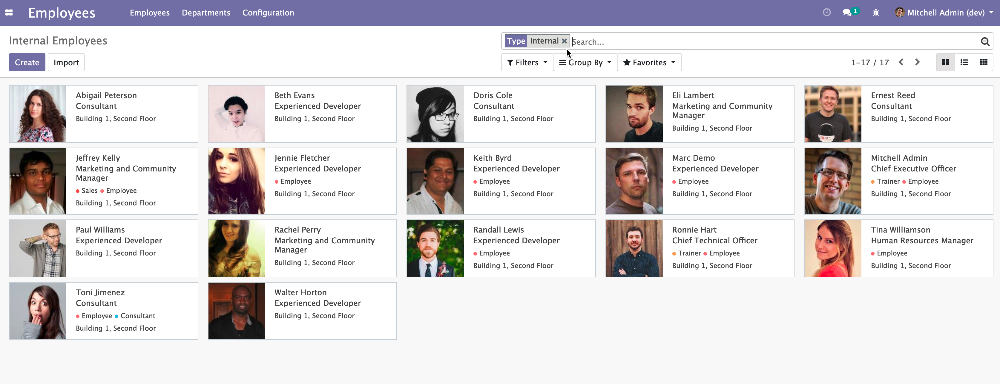
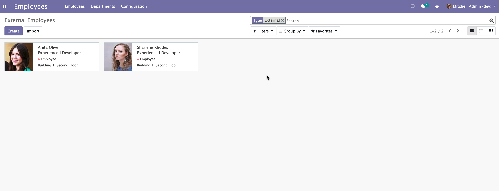
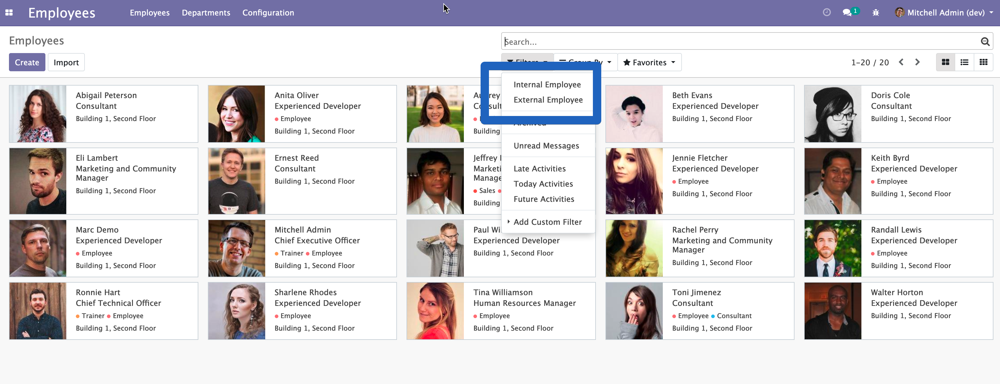

HR Employee Type
================
This module adds the distinction between internal employee and external employee

The module adds a new menu entry to see employee per type

The menu guides to filtered views

of internal employees

of external employees

Also the default employee view, and the new views have additional filters

Contributors
------------
* Numigi (tm) and all its contributors (https://bit.ly/numigiens)
