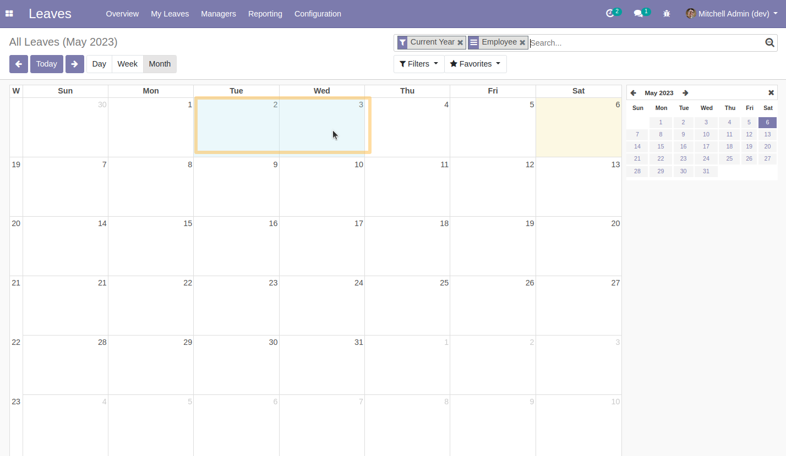
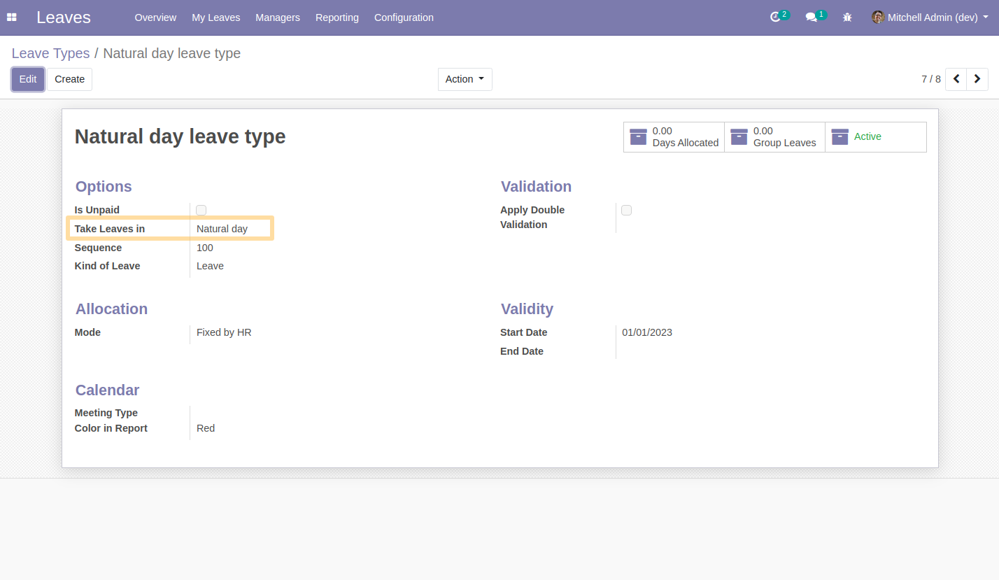
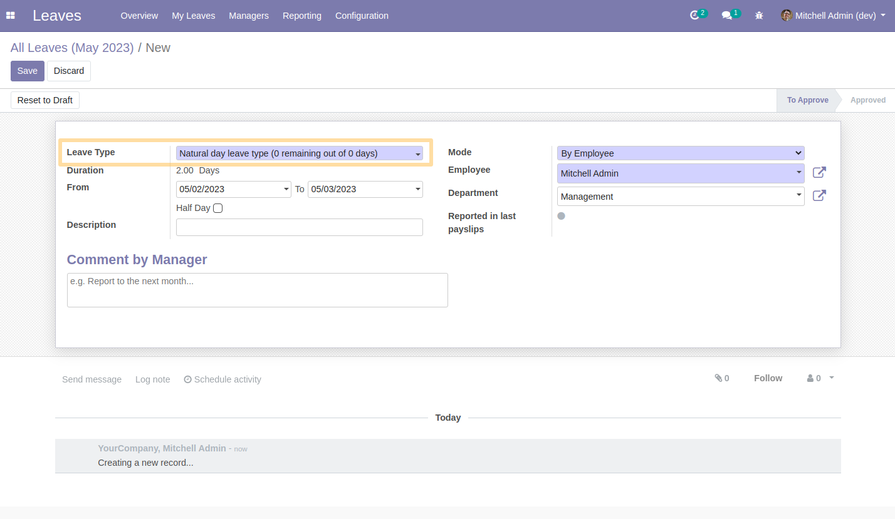
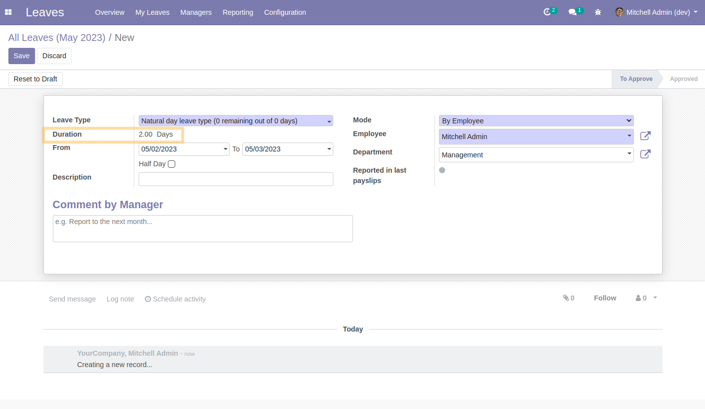

=======================
Holidays natural period
=======================

.. contents:: Table of Contents

Dependencies
------------

The only dependency is the `Leaves` application in Odoo.

Context
-------

THe module allows you to define natural day option in request unit on holidays type.

Usage
-----

For using natural period on leaves:

#. I go to *Leaves > Dashboard*.

#. I select dragging on the calendar the days you want to be on leave, or go
   to the form view for selecting start and end dates.

#. I select the proper "Leave Type" that has "Natural day" selected in "Request unit".

#. If no leave type is yet specified, then default configuration is to exclude
   public holidays.

#. I see that the number of days will be computed without employee calendar used.

Contributors
~~~~~~~~~~~~
* Numigi (tm) and all its contributors (https://bit.ly/numigiens)

* Odoo Community Association <https://odoo-community.org>

* Tecnativa <https://www.tecnativa.com>

    * Víctor Martínez
    * Pedro Baeza

More information
----------------
* Meet us at https://bit.ly/numigi-com
