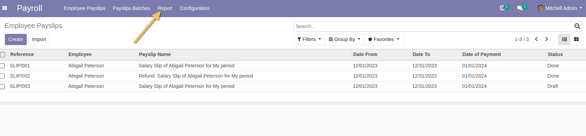
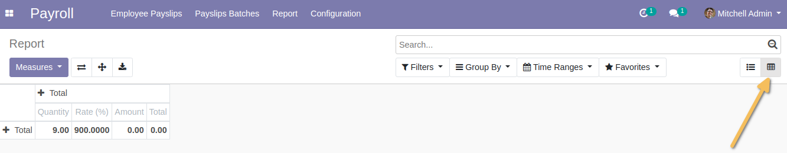

HR Payroll Account Report
=========================
This module allows to have account fields on payroll calculation lines analysis.

Usage
-----
As a user in the Payroll Manager group, when I go to the Payroll application, I find a new `Report` menu.

This menu is only accessible to a Payroll / Manager group.

When I click on this menu, I have a list view of payroll calculation lines.
From this view, I have a button to display the pivot view.

And I see that I can filter or group by all fields by :
*Debit Account*
*Credit Account*
*Analytic Account*

Contributors
------------
* Numigi (tm) and all its contributors (https://bit.ly/numigiens)
