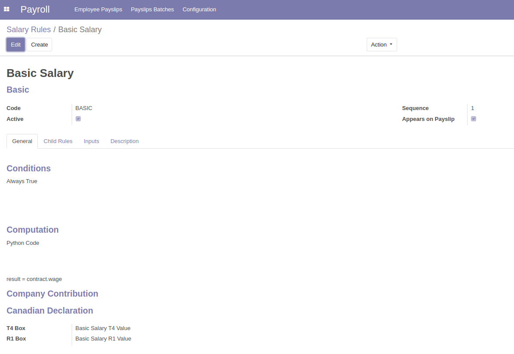

HR Payroll Canadian Declaration
===============================

Context
-------

This module allows to group payslip lines by T1 Box and R1 Box.

When computing the payslip sheet it transfer the value of T1 Box and R1 Box from the salary rule to the payslip lines

Usage
-----

1 - As a payroll user, I go to a salary rule.

2 - I set values for T4 Box and R1 Box .

3 - I create a payslip with a structure having one rule with T4 and R1 Box

4 - I compute payslip sheet

5 - I display the payslip lines ( from the smart button *Payslip* ) and I delete the default filter.

6 - I can group by T4 Box or R1 Box

Contributors
------------
* Numigi (tm) and all its contributors (https://bit.ly/numigiens)