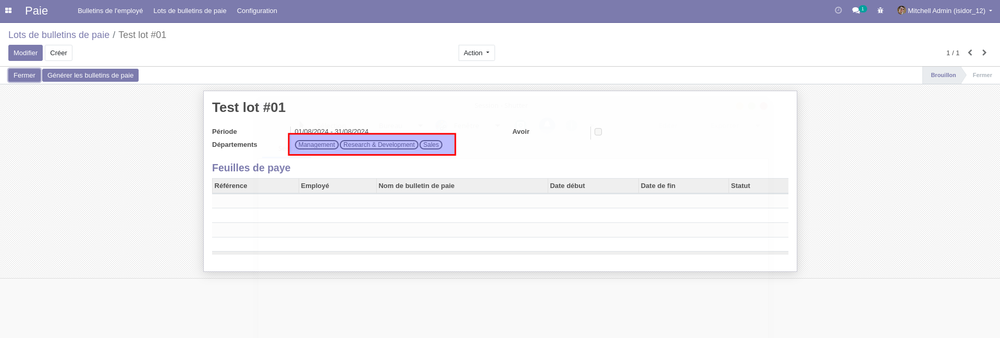
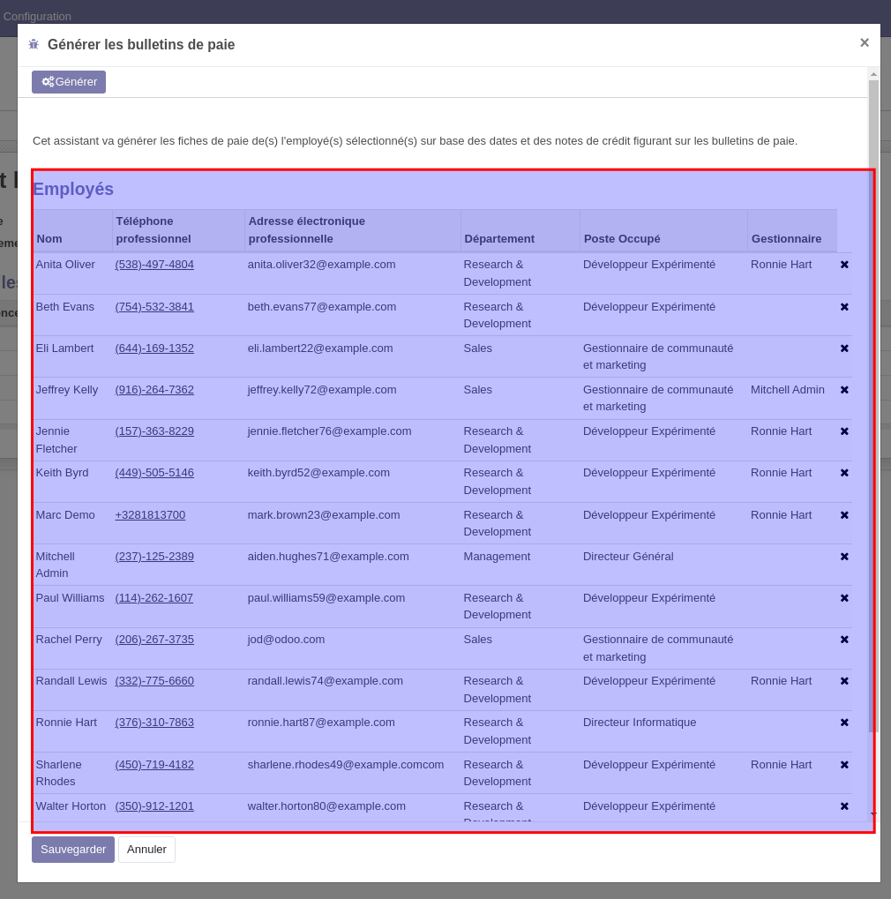

HR Payroll Payslip by Department
===============================

Context
-------

This module allows to generate batch of payslips by department.

When you create a payslip batch, you can select the departments for which you want to generate payslips.

Usage
-----

1 - As a payroll user, I go to Payroll > Payslip Batches

2 - I create a payslip with a structure having one rule with T4 and R1 Box

3 - I compute payslip sheet

Contributors
------------
* Numigi (tm) and all its contributors (https://bit.ly/numigiens)