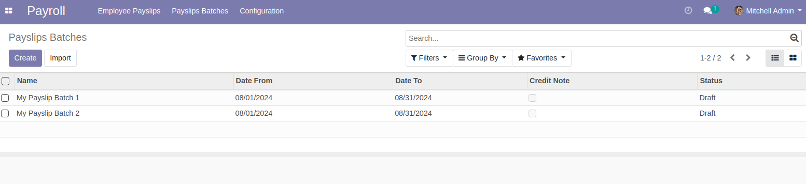
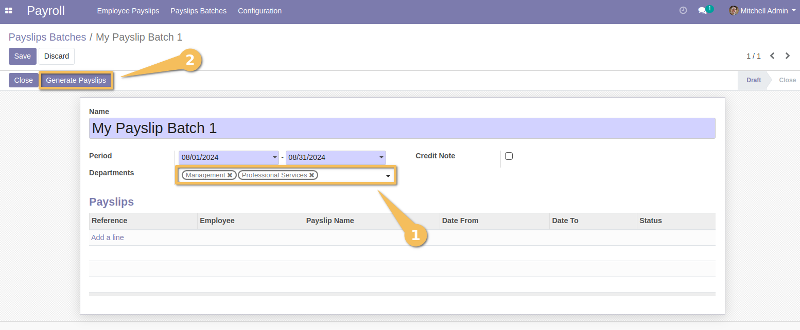
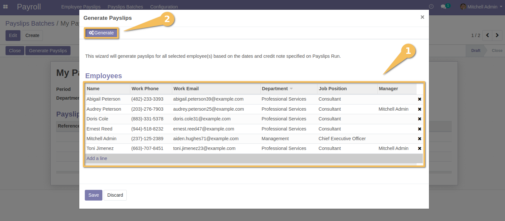
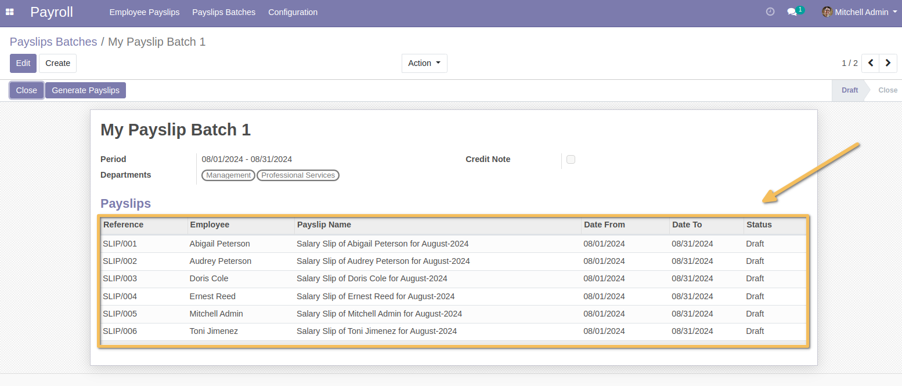

================================
HR Payroll Payslip by Department
================================

Context
-------

This module allows to generate batch of payslips by department.
When you create a payslip batch, you can select the department(s) for which you want to generate payslips.

Usage
-----

As a user with access to create payslips and access the payslip batch wizard, I go to `Payroll > Payslip Batches` to create a new batch of payslips.

Once the batch is created, I define the pay period, and I select the department(s) then I click on the `Generate Payslips` button.

When the next window with the list of employees is displayed (wizard), only employees of the selected department(s) are listed.
Then, I click on the `Generate` button to start creating the payslips.

Contributors
------------
* Numigi (tm) and all its contributors (https://bit.ly/numigiens)