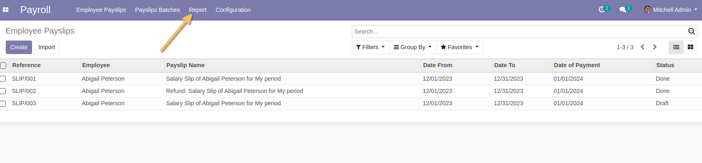
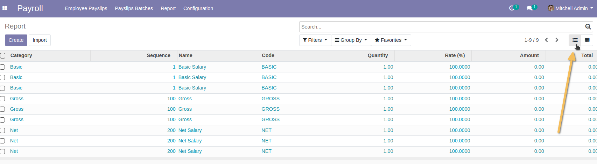
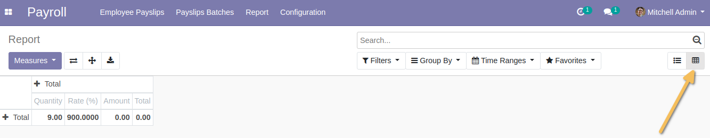

HR Payroll Report
=================
This module allows to make further analysis and control on payroll calculation lines.

Usage
-----
As a user in the Payroll Manager group, when I go to the Payroll application, I find a new `Report` menu.

This menu is only accessible to a Payroll / Manager group.

When I click on this menu, I have a list view of payroll calculation lines.
This list view displays the same fields as this template's existing list view, but without context, it displays all lines from all payrolls, for all employees.

From this view, I have a button to display the pivot view.

This pivot view offers, from the `Measure` button:
*Quantity*
*Rate*
*Amount*
*Total*

I can filter or group by all fields in the model. By :
*Period of payslip*
*Employee*
*Contract*
*Department*
*Payslip rule*
*Category*
*Code*
*Rate*
*Payslip*

Contributors
------------
* Numigi (tm) and all its contributors (https://bit.ly/numigiens)
