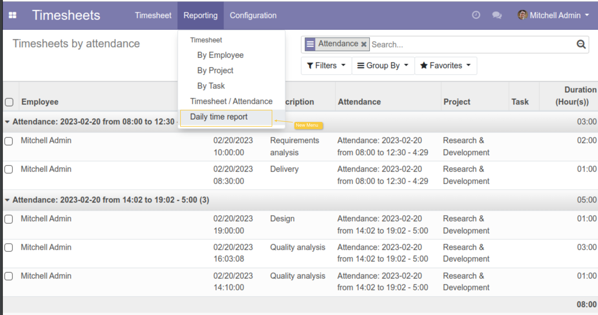
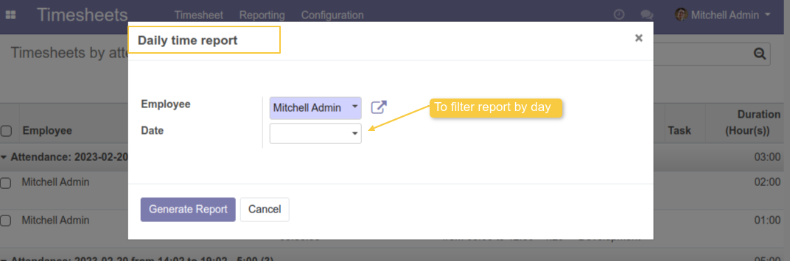
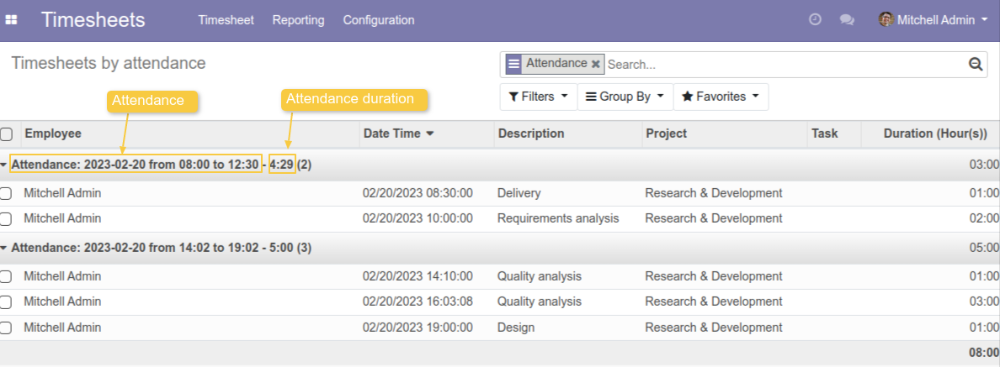

Hr Timesheet Attendance Report
==============================

.. contents:: Table of Contents

Dependencies
------------

https://github.com/OCA/project/project_timesheet_time_control

To have field `date_time` in Timesheets Lines

Context
-------

The module allows you to have visibility on the same view of the detail of the attendance
and time entries of each employee grouped by attendance.

Description
-----------
As member of `Timesheets / Manager`, I go to `Timesheets > Reporting > Daily Time Report`.
A new menu is added `Daily Time Report`

Click on the menu `Daily Time Report`, a popup is shown to select the `Employee` and date to filter the list of Timesheets.
If the `Date` field is not mentioned, the report will display all periods.

Click on `GENERATE REPORT` button to display the report.
The report is grouped by `Attendance`.
The duration is added to the group to compare it with Timesheets durations.

Contributors
------------
* Numigi (tm) and all its contributors (https://bit.ly/numigiens)

More information
----------------
* Meet us at https://bit.ly/numigi-com
