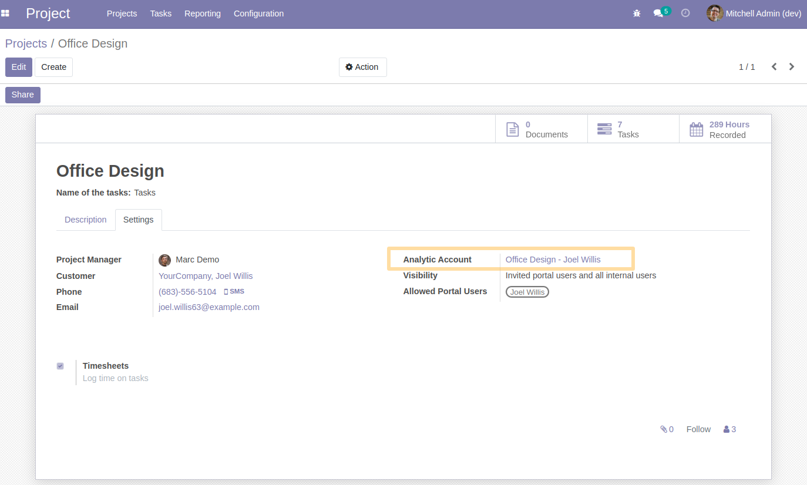
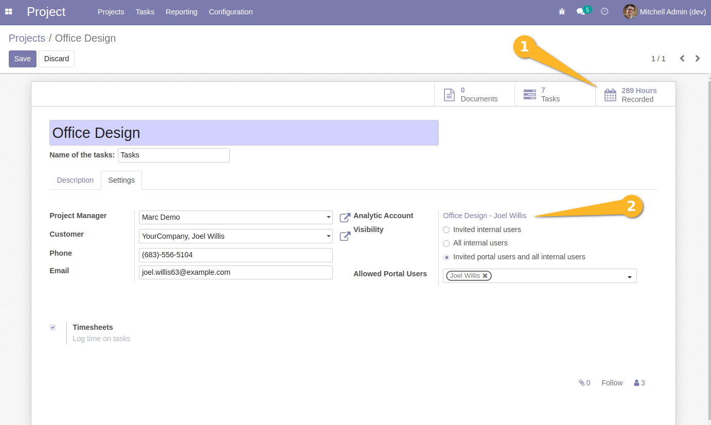
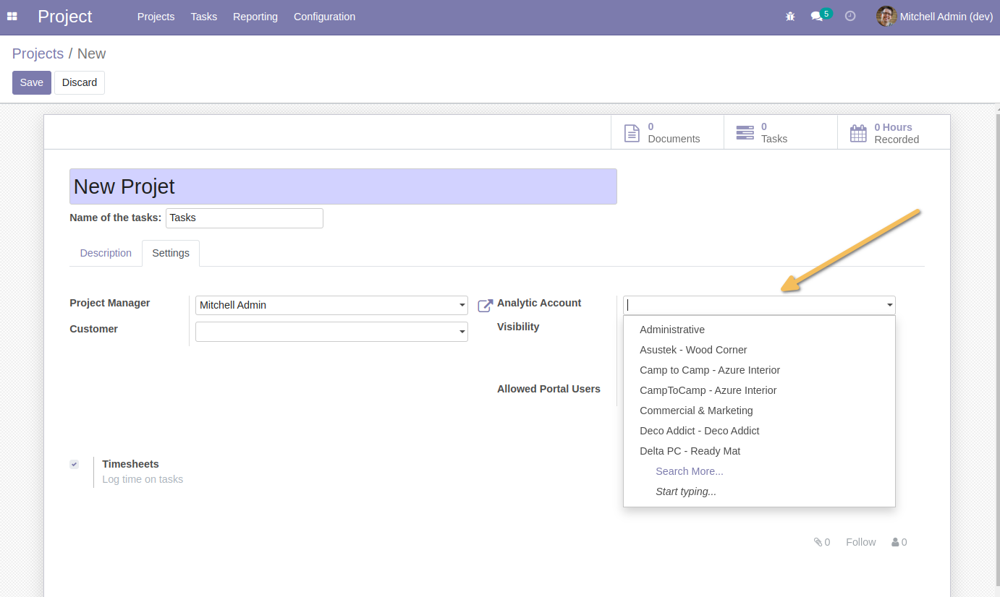

Hr Timesheet Enhanced
=====================

.. contents:: Table of Contents

Description
-----------

If a project is activated, its analytic account too.

If a project is deactivated, analytic account too if it has any analytic line and just this only project associated.

If a project is deleted, analytic account too if it has any analytic lines associated, and analytic account has just this project associated.

If a project has timesheets associated, analytic account is read only in project form view.

Usage
-----

- As a user who can manipulate projects and who has the access right to handle analytic accounts checked in my user profile (debug mode), 
I go to `Project>Configuration>Projects`.

- If I have a project that has timesheets on linked tasks (including archived tasks), and the projects linked to these timesheet lines correspond to the current project, 
the project is qualified as `having timesheets` which implies the read-only setting of the `Analytic Account` field on the project form.

- If I have a project whose projects of the timesheet lines linked to the analytic account correspond to the current project, 
the project will be qualified as `having timesheets`` which also implies the read-only setting of the field `Analytic Account` on the project form.

Notice: timesheet lines linked to account analytic is by default invisible.

- In the opposite cases, the `Analytic Account` field can be modified.

- If I want to update the analytic account of a project (by some write operation like calling write() function on action server or a cron..), and the project is already qualified as `having timesheets` with an analytic account already linked to its account, an error message will be displayed:
``Project ___project_name___ can't change its analytic account, because it has timesheets associated.``.

- If I want to unarchive a project, its analytic account will also be unarchived.

- In the opposite case (archive the project), it will archive the analytic account if it has no linked timesheets and there is no linked project.

- If I want to delete a project, the linked analytic account will also be deleted, not considering whether the account is archived or not.

Contributors
------------
* Numigi (tm) and all its contributors (https://bit.ly/numigiens)
