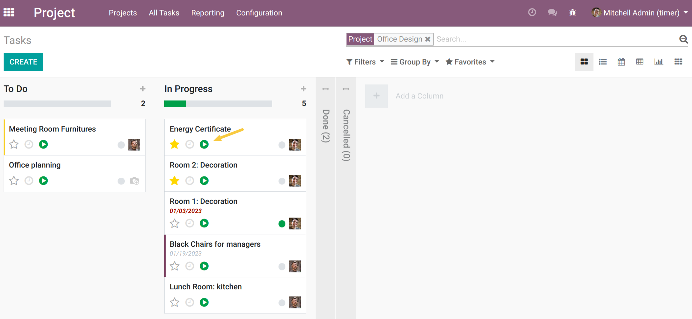

Hr Timesheet Time Control Stop At Checkout
==========================================

.. contents:: Table of Contents

Context
-------

Be able to start timers and not stop them.
When recording the exit of an employee, the current timer(s) are stopped.

This module depends of these following modules:

- `project_timesheet_time_control <https://github.com/OCA/project/tree/12.0/project_timesheet_time_control>`_
- hr_attendance

Usage
-----

New access group
~~~~~~~~~~~~~~~~

As a user who can manage user access rights, I go to the form view of a user.

I see that a new access group named Can Stop Timer is present.

Hide the Stop Timer button
~~~~~~~~~~~~~~~~~~~~~~~~~~

As a `Projects and Timesheets` user, I go to the kanban view of tasks and launch a timer.

I notice that the Stop button is no longer available.

``This behavior is the same everywhere the timer is present.``

As a user in the Can Stop Timer group, I run a timer.
I see that the Stop timer button is present.

Stop timer on check out
~~~~~~~~~~~~~~~~~~~~~~~

As an employee, I go to the `Attendance kiosk`, select my employee (or scan my badge) and register my entry.

As a `Projects and Timesheets` user, I go to the kanban view of tasks and launch a timer.

As an employee, I go to the `Attendance kiosk`, I select my employee (or scan my badge) and I register my exit.

I see that the timer that was running on the task has been stopped and that
the duration represents the time between the start of the timer and the time of recording my check out.

Contributors
------------
* Numigi (tm) and all its contributors (https://bit.ly/numigiens)
